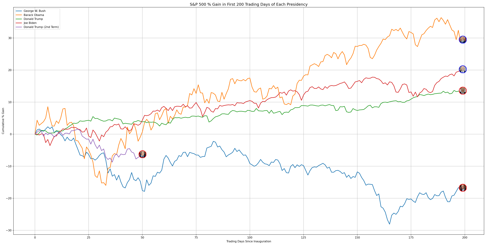
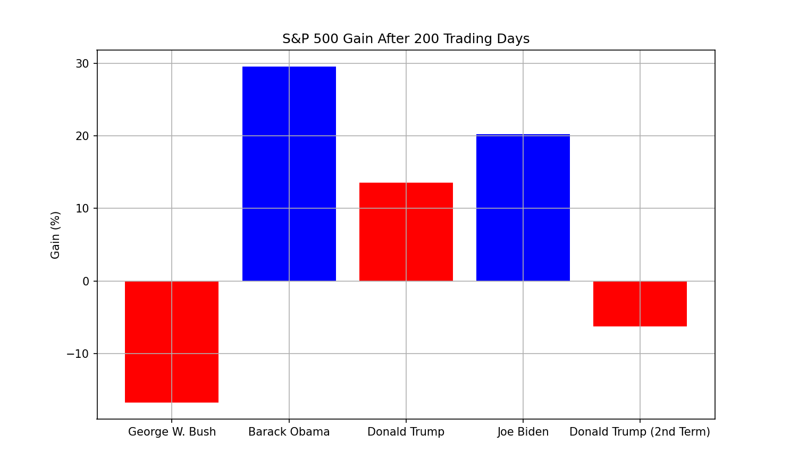

# S&P 500 Performance During Presidential Terms

This project visualizes the performance of the S&P 500 index during the first 200 trading days of each presidential term, starting from their inauguration date.  It uses historical data to calculate and plot the cumulative percentage gain of the S&P 500, with each president represented by a line on the graph.  Presidential portraits are displayed at the terminal point of each line.

## Usage

1.  **Prerequisites:**
    *   Python 3.x
    *   Libraries: pandas, matplotlib, Pillow (PIL)

    Install the required libraries using pip:

    ```bash
    pip install pandas matplotlib Pillow
    ```

2.  **Data:**
    *   Ensure that `sp500.csv` is located in the same directory as `reader.py`. This CSV file should contain historical S&P 500 data with 'Date' and 'Close' columns.  The 'Date' column should be formatted as '%m/%d/%y'.
    *   The `images` folder should contain the president images (`bush.png`, `obama.png`, `trump.png`, `biden.png`, `trump2.png`).

3.  **Execution:**
    *   Run the script `reader.py`:

    ```bash
    python reader.py
    ```

    The script will generate a plot showing the S&P 500 performance for each presidential term.

## Graphs



## Data Source

The S&P 500 data is obtained from [wsj](https://www.wsj.com/market-data/quotes/index/SPX/historical-prices)

## Image Credits

Presidential images are sourced from [wikipedia](https://en.wikipedia.org/wiki/List_of_presidents_of_the_United_States)
